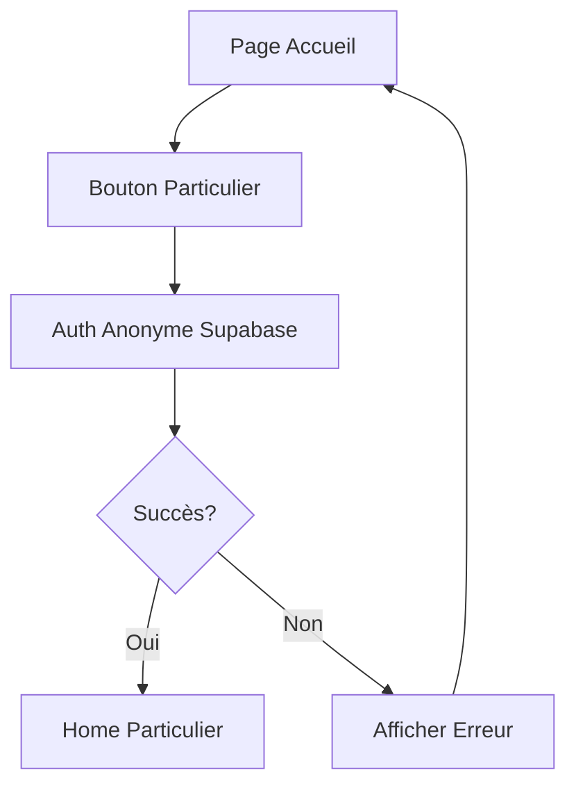
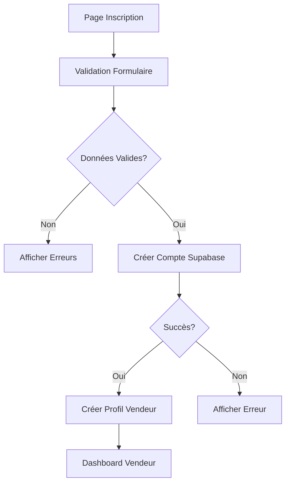

# 🔐 Documentation du Système d'Authentification

## Vue d'ensemble

L'application "Pièces d'Occasion" implémente un système d'authentification multi-profils sophistiqué utilisant **Supabase Auth** avec une architecture **Clean Architecture** et **Riverpod** pour la gestion d'état.

## 🎯 Architecture

### Structure des Couches

```
features/auth/
├── data/               # Couche de données
│   ├── datasources/   # Sources de données (Supabase, cache local)
│   ├── models/        # Modèles de données avec serialization
│   └── repositories/  # Implémentation des repositories
├── domain/            # Couche domaine (logique métier)
│   ├── entities/      # Entités métier
│   ├── repositories/  # Interfaces des repositories
│   └── usecases/      # Cas d'usage
└── presentation/      # Couche présentation
    ├── controllers/   # State management avec Riverpod
    ├── pages/         # Pages UI
    └── widgets/       # Composants réutilisables
```

## 👥 Types d'Utilisateurs

### 1. Particulier
- **Connexion anonyme** : Accès instantané sans inscription
- **Données stockées localement** : Panier, favoris, historique
- **Évolution possible** : Peut créer un compte vendeur

### 2. Vendeur
- **Inscription complète** : Email + mot de passe requis
- **Profil professionnel** : Nom entreprise, téléphone, etc.
- **Fonctionnalités avancées** : Gestion stock, dashboard, analytics

## 🔄 Flux d'Authentification

### État d'Authentification Global

```dart
// États possibles
- Initial          : État de démarrage
- Loading          : Opération en cours
- Authenticated    : Utilisateur connecté
- Unauthenticated : Non connecté
- Error           : Erreur d'authentification
```

## 📱 Parcours Utilisateur

### Écran d'Accueil (`WelcomePage`)
1. **Continuer en tant que particulier** → Connexion anonyme automatique
2. **Je suis un professionnel** → Redirection vers l'espace vendeur

### Espace Particulier
- Connexion anonyme via Supabase Auth
- Session UUID unique générée
- Données stockées dans le cache local
- Pas de gestion de mot de passe

### Espace Vendeur
- **Inscription** : Formulaire complet avec validation
- **Connexion** : Email + mot de passe
- **Mot de passe oublié** : Réinitialisation par email
- **Déconnexion** : Nettoyage session + cache

## 🛡️ Sécurité

### Validation des Données
- **Email** : Regex validation + format check
- **Mot de passe** : Minimum 6 caractères (configurable)
- **Confirmation** : Double saisie lors de l'inscription

### Gestion des Erreurs
```dart
// Types d'erreurs gérées
- ServerFailure      : Erreurs serveur
- NetworkFailure     : Problèmes réseau
- AuthFailure        : Échec authentification
- ValidationFailure  : Données invalides
- CacheFailure      : Erreur cache local
```

### Protection des Routes
- Navigation conditionnelle selon l'état auth
- Guards automatiques via GoRouter
- Redirection si non autorisé

## 🔧 Configuration Technique

### Providers Riverpod

```dart
// Controllers principaux
- particulierAuthControllerProvider
- sellerAuthControllerProvider
- authControllerProvider (orchestrateur)

// Use Cases
- particulierAnonymousAuth
- sellerRegister
- sellerLogin
- sellerForgotPassword
- sellerLogout
```

### Supabase Configuration

```dart
// Variables environnement (app_constants.dart)
- SUPABASE_URL
- SUPABASE_ANON_KEY
- Tables utilisées:
  - auth.users (gestion Supabase)
  - public.sellers (profils vendeurs)
  - public.particuliers (profils particuliers)
```

## 📊 Diagrammes de Flux

### Flux Connexion Particulier


### Flux Inscription Vendeur


## 🚀 Implémentation

### Connexion Anonyme Particulier
```dart
// Controller: particulier_auth_controller.dart
Future<void> signInAnonymously() async {
  state = loading;
  final result = await _particulierAnonymousAuth();
  result.fold(
    (failure) => state = error,
    (particulier) => state = authenticated
  );
}
```

### Inscription Vendeur
```dart
// Controller: seller_auth_controller.dart
Future<void> register({
  required String email,
  required String password,
  String? companyName,
  // ...
}) async {
  state = loading;
  final result = await _sellerRegister(params);
  result.fold(
    (failure) => state = error,
    (seller) => state = authenticated
  );
}
```

## 🧪 Tests

### Tests Unitaires
- Controllers : Mock des use cases
- Use Cases : Mock des repositories
- Repositories : Mock des datasources

### Tests d'Intégration
- Flux complet inscription
- Flux connexion/déconnexion
- Gestion sessions multiples

### Tests E2E
- Parcours utilisateur complet
- Validation formulaires
- Gestion erreurs réseau

## 📋 Checklist de Sécurité

- [x] Validation côté client
- [x] Validation côté serveur (Supabase RLS)
- [x] Hashage mots de passe (Supabase)
- [x] Protection CSRF (tokens Supabase)
- [x] Rate limiting (Supabase config)
- [x] Session timeout configurable
- [x] Nettoyage données sensibles

## 🔗 Liens Utiles

- [Documentation Supabase Auth](https://supabase.io/docs/guides/auth)
- [Clean Architecture Flutter](https://resocoder.com/clean-architecture)
- [Riverpod Documentation](https://riverpod.dev)
- [GoRouter Navigation](https://pub.dev/packages/go_router)

## 📝 Notes de Développement

### Points d'Attention
- Toujours nettoyer le cache lors de la déconnexion
- Gérer les tokens expirés avec refresh automatique
- Implémenter retry logic pour les erreurs réseau
- Logger les tentatives d'authentification échouées

### Améliorations Futures
- [ ] Authentification biométrique
- [ ] OAuth providers (Google, Apple)
- [ ] 2FA pour vendeurs
- [ ] Remember me functionality
- [ ] Session management multi-devices