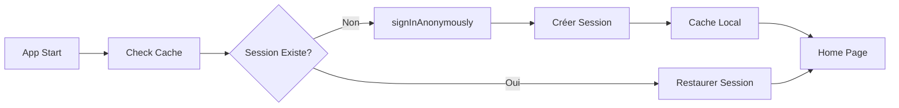

# 👤 Documentation Authentification Particulier

## Vue d'ensemble

Le système d'authentification pour les particuliers est conçu pour offrir une expérience utilisateur **sans friction** avec une connexion anonyme automatique via Supabase Auth.

## 🎯 Objectifs

- **Accès immédiat** : Pas d'inscription requise
- **Expérience fluide** : Connexion transparente en arrière-plan
- **Données persistantes** : Conservation du panier et des favoris
- **Évolution possible** : Transformation en compte vendeur

## 🔄 Flux d'Authentification Anonyme

### 1. Démarrage de l'Application

```dart
// main.dart -> App initialization
1. Vérification session existante
2. Si pas de session → État Initial
3. Affichage WelcomePage
```

### 2. Connexion Anonyme

```dart
// Déclenchée par : "Continuer en tant que particulier"
// Fichier : particulier_auth_controller.dart

Future<void> signInAnonymously() async {
  // 1. État Loading
  state = ParticulierAuthState.loading();

  // 2. Appel Supabase Auth Anonymous
  final result = await _particulierAnonymousAuth(NoParams());

  // 3. Gestion résultat
  result.fold(
    (failure) => state = ParticulierAuthState.error(message),
    (particulier) => state = ParticulierAuthState.anonymousAuthenticated(particulier)
  );
}
```

### 3. Création Session Anonyme

```dart
// particulier_auth_remote_datasource.dart
Future<ParticulierModel> signInAnonymously() async {
  // Appel Supabase
  final response = await _supabase.auth.signInAnonymously();

  // Création profil particulier
  final userId = response.user!.id;
  final particulier = ParticulierModel(
    id: userId,
    createdAt: DateTime.now(),
    isAnonymous: true,
  );

  // Stockage dans la base
  await _supabase
    .from('particuliers')
    .insert(particulier.toJson());

  return particulier;
}
```

## 📊 États du Controller

### ParticulierAuthState

| État | Description | UI Impact |
|------|-------------|-----------|
| `Initial` | État de démarrage | Affiche WelcomePage |
| `Loading` | Connexion en cours | Spinner/Loader |
| `AnonymousAuthenticated` | Connecté anonymement | Accès Home |
| `Error` | Erreur survenue | Message d'erreur |

## 🗄️ Stockage des Données

### Cache Local

```dart
// particulier_auth_local_datasource.dart
class ParticulierAuthLocalDataSource {
  final SharedPreferences _prefs;

  // Clés de stockage
  static const CACHED_PARTICULIER = 'CACHED_PARTICULIER';
  static const SESSION_TOKEN = 'SESSION_TOKEN';

  // Sauvegarde session
  Future<void> cacheParticulier(ParticulierModel particulier) async {
    await _prefs.setString(
      CACHED_PARTICULIER,
      json.encode(particulier.toJson())
    );
  }

  // Récupération session
  Future<ParticulierModel?> getCachedParticulier() async {
    final jsonString = _prefs.getString(CACHED_PARTICULIER);
    if (jsonString != null) {
      return ParticulierModel.fromJson(json.decode(jsonString));
    }
    return null;
  }
}
```

### Données Persistées

- **Session ID** : UUID unique de l'utilisateur anonyme
- **Panier** : Articles sélectionnés
- **Favoris** : Pièces sauvegardées
- **Historique** : Recherches récentes
- **Préférences** : Filtres et paramètres

## 🔐 Sécurité & Limitations

### Utilisateur Anonyme

| Fonctionnalité | Autorisé | Non Autorisé |
|----------------|----------|--------------|
| Parcourir catalogue | ✅ | - |
| Ajouter au panier | ✅ | - |
| Sauvegarder favoris | ✅ | - |
| Contacter vendeur | ✅ | - |
| Publier annonce | ❌ | Compte vendeur requis |
| Accès dashboard | ❌ | Compte vendeur requis |
| Historique commandes | ⚠️ | Limité à la session |

## 🔄 Cycle de Vie Session

### Création


### Expiration

```dart
// Configuration session
const SESSION_DURATION = Duration(days: 30);

// Vérification expiration
Future<bool> isSessionExpired() async {
  final particulier = await getCachedParticulier();
  if (particulier != null) {
    final expirationDate = particulier.createdAt.add(SESSION_DURATION);
    return DateTime.now().isAfter(expirationDate);
  }
  return true;
}
```

### Nettoyage

```dart
// particulier_logout.dart
Future<void> logout() async {
  // 1. Supabase sign out
  await _supabase.auth.signOut();

  // 2. Clear cache
  await _localDataSource.clearCache();

  // 3. Reset state
  state = ParticulierAuthState.initial();
}
```

## 📱 Implémentation UI

### WelcomePage - Bouton Particulier

```dart
// welcome_page.dart
ElevatedButton(
  onPressed: () async {
    // Déclencher connexion anonyme
    await ref
      .read(particulierAuthControllerProvider.notifier)
      .signInAnonymously();
  },
  child: Text('Continuer en tant que particulier'),
)
```

### Gestion Navigation

```dart
// Listen to auth state changes
ref.listen<ParticulierAuthState>(
  particulierAuthControllerProvider,
  (previous, next) {
    next.when(
      initial: () => context.go('/welcome'),
      loading: () {}, // Show loader
      anonymousAuthenticated: (_) => context.go('/home'),
      error: (msg) => showError(msg),
    );
  },
);
```

## 🧪 Tests

### Test Connexion Anonyme

```dart
test('should sign in anonymously successfully', () async {
  // Arrange
  when(mockAuth.signInAnonymously())
    .thenAnswer((_) async => Right(tParticulier));

  // Act
  await controller.signInAnonymously();

  // Assert
  expect(controller.state, isA<AnonymousAuthenticated>());
  verify(mockAuth.signInAnonymously()).called(1);
});
```

### Test Session Persistence

```dart
test('should restore session from cache', () async {
  // Arrange
  when(mockCache.getCachedParticulier())
    .thenAnswer((_) async => tParticulier);

  // Act
  await controller.checkAuthStatus();

  // Assert
  expect(controller.state.isAuthenticated, true);
});
```

## 🚀 Évolution vers Compte Complet

### Transformation en Vendeur

```dart
// Depuis un compte anonyme vers vendeur
Future<void> upgradeToSeller({
  required String email,
  required String password,
}) async {
  // 1. Créer compte vendeur
  final seller = await createSellerAccount(email, password);

  // 2. Migrer données anonymes
  await migrateAnonymousData(
    fromParticulier: currentParticulier,
    toSeller: seller,
  );

  // 3. Supprimer session anonyme
  await deleteAnonymousSession();

  // 4. Connexion vendeur
  await sellerLogin(email, password);
}
```

## 📋 Checklist Intégration

- [x] Connexion anonyme automatique
- [x] Stockage session locale
- [x] Restoration session au démarrage
- [x] Gestion expiration session
- [x] Nettoyage données à la déconnexion
- [x] Navigation conditionnelle
- [x] Tests unitaires
- [x] Tests d'intégration

## 🔧 Configuration Requise

### Supabase

```sql
-- Table particuliers
CREATE TABLE particuliers (
  id UUID PRIMARY KEY DEFAULT uuid_generate_v4(),
  created_at TIMESTAMP DEFAULT NOW(),
  is_anonymous BOOLEAN DEFAULT true,
  email TEXT,
  phone TEXT,
  metadata JSONB
);

-- RLS Policies
CREATE POLICY "Particuliers can view own data"
  ON particuliers FOR SELECT
  USING (auth.uid() = id);

CREATE POLICY "Particuliers can update own data"
  ON particuliers FOR UPDATE
  USING (auth.uid() = id);
```

### Variables Environnement

```dart
// app_constants.dart
class AppConstants {
  static const String supabaseUrl = 'YOUR_SUPABASE_URL';
  static const String supabaseAnonKey = 'YOUR_ANON_KEY';
  static const Duration sessionDuration = Duration(days: 30);
  static const bool autoSignInAnonymous = true;
}
```

## 📝 Notes Importantes

1. **Session Anonyme** : Durée de vie limitée à 30 jours
2. **Données Locales** : Nettoyage automatique après expiration
3. **Migration** : Possibilité d'upgrader vers compte vendeur
4. **Performance** : Cache agressif pour réduire appels API
5. **Sécurité** : Pas de données sensibles en anonymous