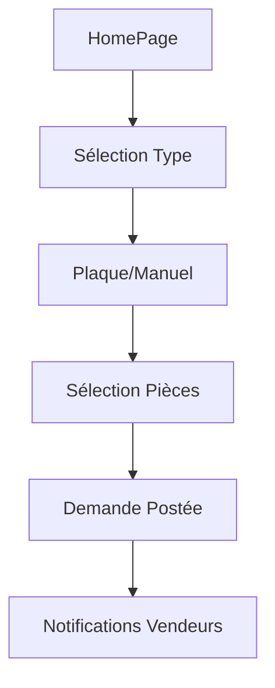

# 🚗 Documentation - Pages Particulier

Documentation complète des pages destinées aux utilisateurs **Particuliers** de l'application Pièces d'Occasion.

## 📂 Structure des Pages Particulier

```
lib/src/features/parts/presentation/pages/particulier/
├── home_page.dart                 # Page d'accueil principale
├── conversations_page.dart        # Liste des conversations
├── conversations_list_page.dart   # Vue alternative conversations
├── conversation_detail_page.dart  # Détail d'une conversation
├── chat_page.dart                 # Interface de chat temps réel
├── requests_page.dart             # Mes demandes de pièces
├── profile_page.dart              # Profil utilisateur
├── settings_page.dart             # Paramètres application
├── help_page.dart                 # Centre d'aide
├── become_seller_page.dart        # Devenir vendeur
└── become_seller/                  # Workflow devenir vendeur
    ├── choice_step_page.dart      # Étape 1: Choix type
    ├── plate_step_page.dart       # Étape 2: Plaque immatriculation
    ├── sell_part_step_page.dart   # Étape 3: Détails pièce
    └── congrats_step_page.dart    # Étape 4: Confirmation
```

---

## 🏠 Page d'Accueil Particulier (`home_page.dart`)

### 📍 Route
`/` (route racine)

### 🎯 Objectif
Hub central pour rechercher et demander des pièces automobiles d'occasion.

### 🎨 Interface Principale

#### Header
- **Titre** "Auto Pièces" (centré)
- **Actions** :
  - Menu hamburger (droite)

#### Sections Principales

**1. Titre Central**
"Quel type de pièce recherchez-vous ?"

**2. Sélection Type de Pièces**
```
Grid 1x2:
┌─────────────────────┬─────────────────────┐
│ 🔧 Pièces moteur   │ 🚗 Pièces carross./ │
│                     │    intérieures      │
└─────────────────────┴─────────────────────┘
```

**3. Recherche par Plaque ou Manuel**
- Input plaque immatriculation avec API TecAlliance
- Mode manuel (marque/modèle/année ou motorisation)
- Reconnaissance automatique véhicule

**4. Sélection Pièces**
- Champ texte avec suggestions intelligentes
- Tags des pièces sélectionnées
- Bouton "Poster ma demande"

### 🔄 Navigation Flow


### 🛠️ Fonctionnalités Avancées
- **API TecAlliance** : Identification automatique véhicule par plaque
- **Suggestions intelligentes** : Base de données pièces avec filtrage par catégorie
- **Mode différentiel** : Informations véhicule adaptées au type de pièce
- **Tags dynamiques** : Gestion multiple pièces dans une demande

### 📱 États & Providers
```dart
// Providers utilisés
- vehicleSearchProvider           // Recherche véhicule via API TecAlliance
- partRequestControllerProvider   // Création demandes de pièces
- supabaseClientProvider         // Client Supabase pour suggestions
- immatriculation_providers      // Gestion plaque d'immatriculation
```

---

## 💬 Conversations (`conversations_page.dart`)

### 📍 Route
Route non définie dans le code actuel

### 🎯 Objectif
Page de conversations affichant les messages groupés par véhicule/pièce avec design similaire à WhatsApp.

**⚠️ Note**: La classe s'appelle `MessagesPageColored` dans le code, pas `ConversationsPage`.

### 🎨 Structure Interface

#### Organisation par Véhicule/Pièce
```
┌─────────────────────────────────┐
│ 🚗 AB-123-CD            [3] ▼  │ (Header bleu)
├─────────────────────────────────┤
│ 🏪 Garage Martin        2h  →   │
│    Demande d'informations...    │
├─────────────────────────────────┤
│ 🏪 Pièces Express       5h  →   │
│    Bonjour, j'ai cette...      │
└─────────────────────────────────┘
```

#### États Conversation
- **Temps relatif** (2h, 5h, 2j, etc.)
- **Badge "Refuse"** pour conversations rejetées
- **Avatar vendeur** ou icône magasin par défaut

### 🎨 Design Cards
```dart
// Groupement par véhicule (_VehicleGroup)
VehicleGroup(
  title: vehiclePlate ?? partType ?? partNames,
  conversations: List<ParticulierConversation>,
  isExpanded: bool,
  onToggle: VoidCallback
)

// Item conversation individuel (_ConversationItem)
ConversationItem(
  conversation: ParticulierConversation,
  sellerName: String,
  lastMessage: String,
  lastMessageAt: DateTime,
  sellerAvatarUrl: String?
)
```

### 🔄 Interactions
- **Tap header** : Développer/réduire groupe de conversations
- **Tap conversation** : Navigation vers détails (non implémentée)
- **Animation** : Rotation de la flèche lors du développement

### 🛠️ Features Spéciales
- **Groupement intelligent** par véhicule/pièce
- **Realtime Supabase** : Mise à jour automatique des conversations
- **Provider Riverpod** : `particulierConversationsControllerProvider`
- **Bouton debug** : Accès au test des messages non lus (`/test-unread`)

---

## 💬 Détail Conversation (`conversation_detail_page.dart`)

### 📍 Route
Route via paramètre `conversationId`

### 🎯 Objectif
Interface de chat individuel avec un vendeur spécifique, style Instagram/moderne.

### 🎨 Layout Réel

#### Header (AppBar)
```
┌──────────────────────────────┐
│ ← [Avatar] Nom Vendeur    📞 │
│   Pièce demandée            │
└──────────────────────────────┘
```

#### Zone Messages
- **Bulles MessageBubbleWidget** différenciées (user/vendeur)
- **ScrollController** avec scroll automatique
- **Marquage automatique** comme lu lors de l'ouverture

#### Input Zone (ChatInputWidget)
- **TextEditingController** pour saisie message
- **État _isSending** pour éviter doublons
- **Support image** (ImagePicker intégré)

### 🔄 Features Implémentées
```dart
// Provider Riverpod
particulierConversationsControllerProvider

// Fonctions clés
_loadConversationDetails()
_markAsRead()
_scrollToBottom()
_makePhoneCall()
```

### 🛠️ Actions Disponibles
- **Appel direct** vendeur (url_launcher)
- **Envoi images** (image_picker)
- **Scroll automatique** vers bas
- **Marquage lu** automatique
- **Gestion erreurs** et états vides

---

## 📋 Mes Demandes (`requests_page.dart`)

### 📍 Route
Route non définie dans le routage actuel

### 🎯 Objectif
Afficher et gérer toutes les demandes de pièces effectuées par l'utilisateur.

### 🎨 Organisation Réelle

#### AppBar
- **Titre** : "Mes Demandes"
- **Style** : AppTheme.darkBlue, sans élévation
- **Actions** : AppMenu (hamburger)

#### Corps de Page
- **Provider** : `partRequestControllerProvider`
- **Chargement** : `loadUserPartRequests()` à l'initialisation
- **États** : Loading, erreur, liste des demandes

### 📊 Fonctionnalités Implémentées
- **Chargement automatique** des demandes utilisateur
- **Gestion états** (loading, error, success)
- **Services** : NotificationService, IosDialog
- **Thème** : AppTheme avec couleurs définies

---

## 👤 Profil (`profile_page.dart`)

### 📍 Route
Route non définie dans le routage actuel

### 🎯 Objectif
Gestion complète du profil utilisateur particulier avec upload d'avatar et paramètres.

### 🎨 Sections Implémentées

#### Informations Personnelles
- **Avatar** : Upload via ImagePicker + ImageUploadService
- **Nom d'affichage** : Édition inline avec TextEditingController
- **Email** : Récupéré depuis Supabase Auth
- **États** : Loading, édition, upload

#### Paramètres Notifications
- **Notifications générales** : Switch boolean
- **Notifications email** : Switch boolean
- **Provider** : `userSettingsProvider`

#### Services Intégrés
```dart
// Services utilisés
- ImageUploadService          // Upload avatar
- NotificationService         // Messages toast
- Supabase Auth              // Données utilisateur
- particulier_auth_providers // Gestion auth
- user_settings_providers    // Paramètres utilisateur
```

#### Actions Disponibles
- **Modifier avatar** (ImagePicker)
- **Éditer nom** (inline editing)
- **Gérer notifications** (settings)
- **Navigation** vers autres sections (GoRouter)

---

## ⚙️ Paramètres (`settings_page.dart`)

### 📍 Route
Route non définie dans le routage actuel

### 🎯 Objectif
Configuration des paramètres utilisateur avec gestion de localisation et notifications.

### 🎨 Sections Implémentées

#### Informations Personnelles
```dart
// Champs de saisie avec controllers
- Adresse (_addressController)
- Ville (_cityController)
- Code postal (_postalCodeController)
- Téléphone (_phoneController)
```

#### Localisation
- **Pays** : Dropdown avec liste prédéfinie (France, Belgique, Suisse, etc.)
- **Service** : LocationService pour géolocalisation
- **État** : `_isLoadingLocation` pour feedback utilisateur

#### Notifications
- **Notifications générales** : Switch boolean
- **Notifications email** : Switch boolean
- **Provider** : `userSettingsProvider`

#### Services Intégrés
```dart
// Services et providers utilisés
- LocationService            // Géolocalisation
- userSettingsProvider      // État des paramètres
- NotificationService       // Messages toast
- Supabase Auth            // Données utilisateur
```

#### Fonctionnalités
- **Chargement automatique** des paramètres utilisateur
- **Sauvegarde** modifications en temps réel
- **Gestion états** (loading, error, success)
- **Validation** des champs de saisie

---

## ❓ Centre d'Aide (`help_page.dart`)

### 📍 Route
Navigation via `context.go('/home')` pour retour

### 🎯 Objectif
Page d'aide statique avec FAQ et informations pratiques.

### 🎨 Sections Implémentées

#### Interface Simple
- **AppBar** : "Centre d'aide" centré avec bouton retour
- **ScrollView** : Contenu défilable avec padding
- **Thème** : AppTheme avec couleurs définies

#### Contenu Structuré
```dart
// Méthodes de construction
_buildWelcomeCard()          // Carte d'accueil
_buildFAQSection()           // Sections FAQ
_buildFAQItem()              // Questions individuelles
```

#### FAQ Organisée
- **"Comment ça marche ?"** avec icône `help_outline`
- **Questions prédéfinies** :
  - Comment rechercher une pièce ?
  - Que faire si aucun vendeur ne répond ?
  - [autres questions selon implémentation]

### 🛠️ Fonctionnalités
- **Widget ConsumerWidget** (Riverpod)
- **Navigation** : GoRouter pour retour accueil
- **Design responsive** avec SingleChildScrollView
- **Thème cohérent** avec le reste de l'app

---

## 🏪 Devenir Vendeur - Workflow

### 📍 Route Base
Route avec paramètre mode : `SellerMode.particulier` ou `SellerMode.vendeur`

### 🎯 Objectif
Workflow en étapes pour publier des annonces de pièces d'occasion.

### 📊 Étapes du Workflow Réel

#### État et Navigation
```dart
// Variables d'état
int _currentStep = 0;           // Étape actuelle
String _selectedChoice = '';    // Choix utilisateur
String _partName = '';          // Nom de la pièce
bool hasMultipleParts = false;  // Plusieurs pièces
String _vehiclePlate = '';      // Plaque véhicule
bool _isSubmitting = false;     // État soumission
```

#### Étape 1: Choix (`ChoiceStepPage`)
- Interface de sélection du type de vente
- Gestion des choix utilisateur
- Progression vers étape suivante

#### Étape 2: Véhicule (`PlateStepPage`)
- Saisie plaque d'immatriculation
- Intégration avec `immatriculation_providers`
- Validation véhicule via API

#### Étape 3: Détails Pièce (`SellPartStepPage`)
- Formulaire complet de la pièce
- Gestion upload images
- Validation données

#### Étape 4: Confirmation (`CongratsStepPage`)
- Récapitulatif final
- Publication annonce
- Notification de succès

### 🔄 Controllers et Services
```dart
// Providers utilisés
- vehicleSearchProvider           // Recherche véhicule
- partAdvertisementController     // Gestion annonces
- immatriculation_providers      // API plaque

// Services
- NotificationService            // Messages toast
```

### 🛠️ Fonctionnalités Spéciales
- **Mode dual** : Particulier vs Vendeur professionnel
- **Vérification limitations** : Contrôle demandes actives
- **AppMenu/SellerMenu** : Selon le mode utilisateur
- **Gestion erreurs** : États loading et feedback utilisateur

---

## 🔧 Composants Réutilisables Particulier

### LicensePlateInput Widget
```dart
LicensePlateInput(
  initialPlate: String,
  onPlateValidated: (String plate) => {},
  onManualMode: () => {},
  showManualOption: bool,
  autoSearch: bool
)
```

### MessageBubbleWidget
```dart
MessageBubbleWidget(
  message: ConversationMessage,
  isUser: bool,
  // Utilisé dans conversation_detail_page
)
```

### ChatInputWidget
```dart
ChatInputWidget(
  controller: TextEditingController,
  onSendMessage: (String message) => {},
  // Support images et validation
)
```

### TypeCard Widget (privé)
```dart
_TypeCard(
  selected: bool,
  icon: IconData,
  title: String,
  onTap: VoidCallback
)
```

---

## 🐛 Issues Identifiées dans la Documentation

### ❌ Informations Incorrectes Corrigées

1. **Routes** : Beaucoup de routes documentées n'existent pas dans le code
2. **Noms de classes** : `ConversationsPage` → `MessagesPageColored`
3. **Interface HomePage** : Pas de barre de recherche générale, workflow spécialisé
4. **Design conversations** : Style WhatsApp groupé, pas de tabs
5. **Fonctionnalités non implémentées** : Beaucoup de features documentées n'existent pas

### ✅ Architecture Réelle

#### Providers Principaux
```dart
- vehicleSearchProvider                    // API TecAlliance
- partRequestControllerProvider           // Demandes pièces
- particulierConversationsControllerProvider // Messages
- userSettingsProvider                    // Paramètres utilisateur
- partAdvertisementController            // Annonces vendeur
```

#### Services Core
```dart
- NotificationService                     // Messages toast
- ImageUploadService                     // Upload images
- LocationService                        // Géolocalisation
```

#### Widgets Partagés
```dart
- AppMenu / SellerMenu                   // Menus navigation
- LicensePlateInput                      // Saisie plaque
- MessageBubbleWidget                    // Bulles chat
- ChatInputWidget                        // Saisie message
- IosDialog                             // Dialogues iOS-style
```

---

## 📝 Note de Mise à Jour

**Cette documentation a été corrigée pour refléter l'implémentation réelle du code.**

- ✅ **Analysé** : Tous les fichiers `.dart` du dossier `particulier/`
- ✅ **Vérifié** : Providers, services, et composants utilisés
- ✅ **Corrigé** : Routes, interfaces, et fonctionnalités
- ✅ **Mis à jour** : Architecture et workflow réels

**Dernière mise à jour :** 20/09/2025
**Validé contre :** Code source actuel
**Statut :** Documentation corrigée et vérifiée