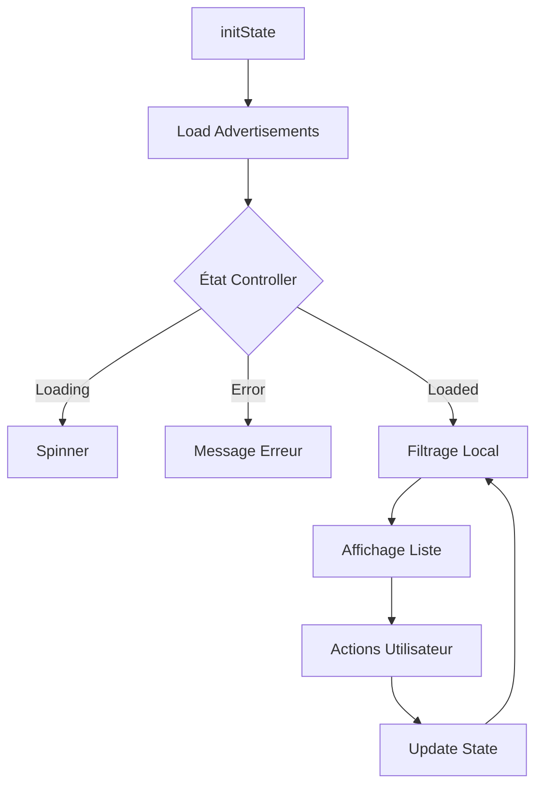

# 📦 Gestion Inventaire - Documentation Technique

## 📌 Vue d'ensemble

La page Gestion Inventaire (`my_ads_page.dart`) permet aux vendeurs professionnels de gérer l'ensemble de leurs annonces de pièces automobiles. Interface centrale pour le suivi du stock, la modification des statuts et l'analyse des performances commerciales.

## 🎯 Objectif Principal

Offrir aux vendeurs une interface complète pour :
- Visualiser toutes leurs annonces de pièces
- Filtrer par statut (actives, vendues, pausées)
- Gérer le cycle de vie des annonces
- Suivre les statistiques par annonce
- Effectuer des actions rapides sur le stock

## 🏗️ Architecture Technique

### Localisation
```
lib/src/features/parts/presentation/pages/Vendeur/my_ads_page.dart
```

### Type de Widget
- **ConsumerStatefulWidget** : Gestion d'état avec Riverpod
- **Stateful** : État local pour les filtres et interactions

### Providers Utilisés
| Provider | Rôle | Type |
|----------|------|------|
| `partAdvertisementControllerProvider` | Gestion des annonces | StateNotifier |
| `currentSellerProvider` | Vendeur connecté | AsyncValue<Seller> |

## 📱 Interface Utilisateur

### Structure de la Page

#### 1. **AppBar avec Actions**
```dart
AppBar:
  - Titre: "Mes annonces"
  - Couleur: Bleu Material (#1976D2)
  - Actions:
    • Bouton ajouter (add_circle_outline)
    • Menu vendeur (SellerMenu)
  - Design: Gradient subtil
```

#### 2. **Barre de Filtres Horizontale**
```dart
Filtres disponibles:
  - Toutes (compteur total)
  - Actives (compteur)
  - Vendues (compteur)
  - Pausées (compteur)
```

**Caractéristiques** :
- Scroll horizontal pour mobile
- Chips avec compteurs dynamiques
- Sélection visuelle (fond bleu)
- Mise à jour temps réel des compteurs

#### 3. **Liste des Annonces**
```dart
ListView avec:
  - Padding uniforme (16px)
  - Séparateurs (16px)
  - Cards modernes avec ombres
  - Pull-to-refresh intégré
```

#### 4. **Card Annonce (_AdCard)**
Structure de chaque carte :
- **En-tête** : Nom de la pièce + Badge statut
- **Corps** : Informations véhicule
- **Footer** : Statistiques + Actions

## 🎨 Design des Cards

### Structure Détaillée
```
┌─────────────────────────────────────┐
│ [Nom Pièce]            [Badge État] │
│                                     │
│ Marque Modèle Année Moteur         │
│                                     │
│ 📧 0 messages     [▶️/⏸️] [⋮]      │
└─────────────────────────────────────┘
```

### États et Couleurs
| Statut | Couleur | Icône | Code Hex |
|--------|---------|-------|----------|
| Active | Vert | visibility | #00C853 |
| Vendue | Bleu | check_circle | #1976D2 |
| Pausée | Orange | pause_circle | #FF9800 |
| Inconnue | Gris | help | #9E9E9E |

## 🔄 Flux de Données

### Cycle de Vie des Données


### Gestion des Filtres
```dart
filteredAds getter:
  1. Récupère toutes les annonces
  2. Applique le filtre sélectionné
  3. Retourne la liste filtrée
  4. Mise à jour automatique via Consumer
```

## 💼 Fonctionnalités Principales

### 1. **Filtrage Dynamique**
```dart
_selectedFilter: String
  - 'all': Toutes les annonces
  - 'active': Annonces actives
  - 'sold': Annonces vendues
  - 'paused': Annonces en pause
```

### 2. **Actions sur les Annonces**

#### Toggle Statut (Activer/Pauser)
```dart
_toggleAdStatus(advertisement):
  - Active → Pausée
  - Pausée → Active
  - Vendue → Aucune action
```

#### Marquer comme Vendue
```dart
_markAsSold(advertisement):
  - Change statut → 'sold'
  - Désactive autres actions
  - Met à jour l'affichage
```

#### Supprimer une Annonce
```dart
_deleteAdvertisement(advertisement):
  1. Confirmation iOS Dialog
  2. Suppression via controller
  3. Notification succès/erreur
  4. Rafraîchissement auto
```

### 3. **Menu Contextuel (PopupMenu)**
Options disponibles :
- **Marquer vendue** (si non vendue)
- **Supprimer** (toujours disponible)

## 🔐 Gestion des États

### États de la Page

#### 1. État Chargement
```dart
Center(
  child: CircularProgressIndicator()
)
```

#### 2. État Erreur
```dart
Affiche:
  - Icône error_outline
  - Message d'erreur
  - Bouton "Réessayer"
```

#### 3. État Vide
```dart
Affiche:
  - Icône inventory_2_outlined
  - Message contextuel selon filtre
  - Suggestion d'action
```

#### 4. État avec Données
```dart
ListView avec:
  - Cards interactives
  - Actions disponibles
  - Statistiques en temps réel
```

## 📊 Statistiques par Annonce

### Métriques Affichées
| Métrique | Icône | Source | État |
|----------|-------|--------|------|
| Messages | message | Backend | TODO |
| Vues | visibility | Backend | TODO |
| Favoris | favorite | Backend | TODO |

### Format d'Affichage
```dart
[Icône] [Valeur] [Label]
Exemple: 📧 12 messages
```

## 🎨 Système de Design

### Palette de Couleurs
```dart
const blue = Color(0xFF1976D2);   // Principal
const green = Color(0xFF00C853);  // Actif
const orange = Color(0xFFFF9800); // Pause
const grey = Color(0xFF9E9E9E);   // Inactif
```

### Composants Visuels
- **BorderRadius** : 16px (cards), 20px (chips), 12px (badges)
- **Elevation** : BoxShadow subtile (0.04 opacity)
- **Padding** : 16px standard, 8px compact
- **Typography** : 18px titres, 14px body, 12px labels

## 🚀 Optimisations Performance

### Techniques Implémentées
1. **Filtrage côté client** : Évite requêtes serveur
2. **Consumer localisé** : Rebuild minimal
3. **Keys sur ListView** : Optimisation diffing
4. **HapticFeedback** : Retour tactile immédiat

### Bonnes Pratiques
```dart
// Utilisation de getter pour filtrage
List<PartAdvertisement> get filteredAds {
  // Logique de filtrage réactive
}

// Vérification mounted avant setState
if (mounted) {
  setState(() {
    _selectedFilter = value;
  });
}

// Feedback haptique sur interactions
HapticFeedback.lightImpact();
```

## 🔧 Configuration et Dépendances

### Imports Requis
```dart
import 'package:flutter_riverpod/flutter_riverpod.dart';
import 'package:flutter/services.dart'; // HapticFeedback
import '../../../../../core/theme/app_theme.dart';
import '../../controllers/part_advertisement_controller.dart';
```

### Modèles de Données
```dart
class PartAdvertisement {
  final String id;
  final String partName;
  final String status; // 'active', 'sold', 'paused'
  final String? vehicleBrand;
  final String? vehicleModel;
  final int? vehicleYear;
  final String? vehicleEngine;
}
```

## 📱 Responsive Design

### Adaptations Mobile
- Scroll horizontal pour les filtres
- Cards pleine largeur
- Actions compactes (IconButton)
- PopupMenu pour actions secondaires

### Points de Rupture
- **Mobile** : < 600px (optimisé)
- **Tablet** : 600-900px (cards en grille)
- **Desktop** : > 900px (vue table possible)

## 🧪 Scénarios de Test

### Tests Unitaires
- [ ] Logique de filtrage
- [ ] Changement de statut
- [ ] Validation avant suppression
- [ ] Gestion des erreurs

### Tests d'Intégration
- [ ] CRUD complet annonce
- [ ] Synchronisation avec backend
- [ ] Persistance des filtres
- [ ] Rafraîchissement des données

### Tests UI
- [ ] Interaction avec filtres
- [ ] Swipe actions (futur)
- [ ] Pull-to-refresh
- [ ] Animations transitions

## 📈 Métriques Métier

### KPIs à Suivre
1. **Taux de conversion** : Active → Vendue
2. **Durée moyenne de vente**
3. **Nombre de pauses** par annonce
4. **Taux d'interaction** (messages/vue)
5. **Stock moyen** par vendeur

### Analytics Events
```dart
// Exemples d'événements à tracker
- filter_changed: {filter: 'active'}
- ad_status_changed: {from: 'active', to: 'paused'}
- ad_deleted: {ad_id: 'xxx', reason: 'manual'}
- ad_marked_sold: {ad_id: 'xxx', duration_days: 5}
```

## 🔮 Évolutions Planifiées

### Court Terme (Sprint 1-2)
- [ ] Statistiques réelles (messages, vues)
- [ ] Recherche textuelle
- [ ] Tri par date/prix
- [ ] Export CSV des annonces

### Moyen Terme (Sprint 3-4)
- [ ] Actions par lot (sélection multiple)
- [ ] Duplication d'annonce
- [ ] Historique des modifications
- [ ] Notifications push statut

### Long Terme (Sprint 5+)
- [ ] Analytics dashboard
- [ ] A/B testing prix
- [ ] Suggestions IA pour optimisation
- [ ] Intégration marketplace externes

## 🐛 Problèmes Connus et TODOs

### Bugs Actuels
1. **Statistiques** : Valeurs hardcodées à 0
2. **Navigation** : onTap carte non implémenté
3. **Pagination** : Absence de pagination serveur

### TODOs Prioritaires
```dart
// TODO: Implémenter les stats
_buildStat(Icons.message, '0', 'messages')

// TODO: Navigation détail annonce
onTap: () {
  // Navigation vers le détail
}

// TODO: Pagination pour grandes listes
// Implémenter infinite scroll
```

## 📚 Documentation Associée

### Liens Internes
- [Controller Annonces](../controllers/advertisement-controller.md)
- [API Endpoints](../api/advertisements-api.md)
- [Design System](../design/components.md)
- [Tests Inventaire](../tests/inventory-tests.md)

### Ressources Externes
- [Material Design Cards](https://material.io/components/cards)
- [Riverpod Best Practices](https://riverpod.dev/docs/concepts/best_practices)
- [Flutter ListView Performance](https://flutter.dev/docs/cookbook/lists/long-lists)

## 🔒 Sécurité et Permissions

### Contrôles d'Accès
- Vérification vendeur authentifié
- Filtrage annonces par seller_id
- Validation propriétaire avant actions
- Rate limiting sur les updates

### Validation des Données
```dart
// Validation avant action
if (advertisement.sellerId != currentSeller.id) {
  throw UnauthorizedException();
}
```

---

**Dernière mise à jour** : 20/09/2025
**Mainteneur** : Équipe Professional
**Version** : 1.0.0
**Statut** : Production Ready ✅