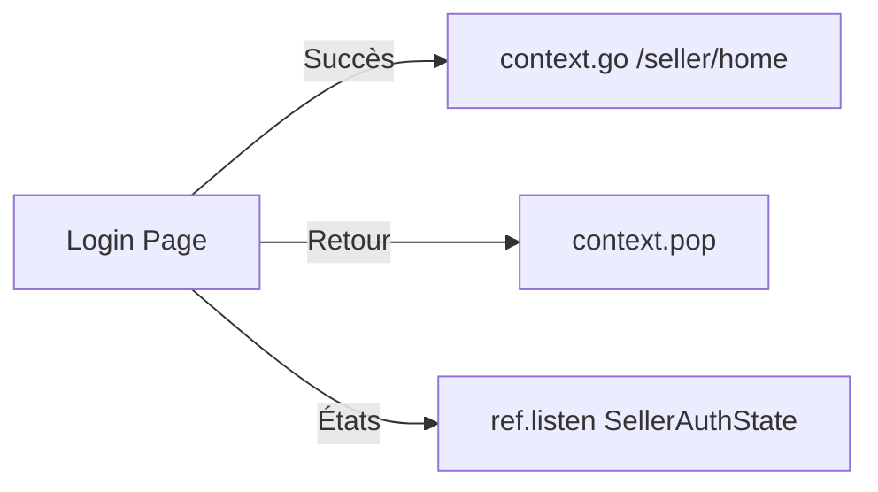
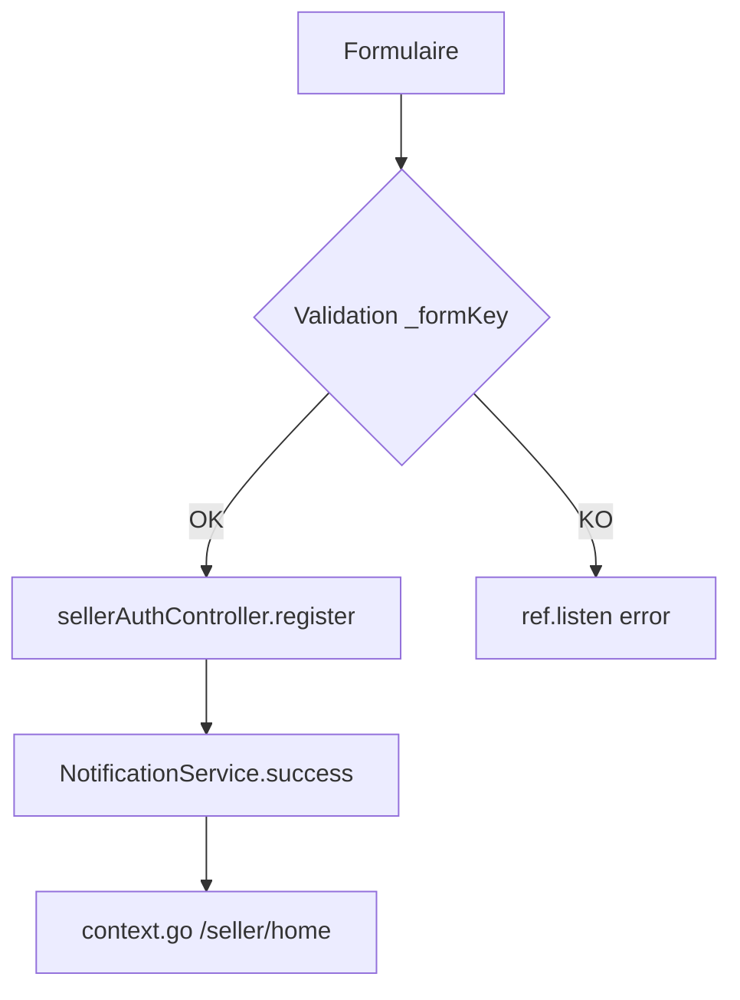
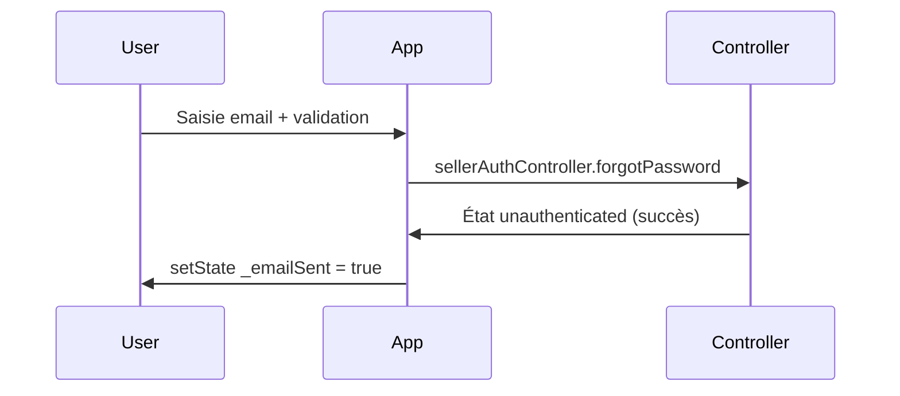

# 🔐 Documentation - Pages d'Authentification

Cette documentation détaille toutes les pages liées à l'authentification dans l'application **Pièces d'Occasion**.

## 📂 Structure des Pages

```
lib/src/features/auth/presentation/pages/
├── welcome_page.dart              # Page d'accueil principale
├── yannko_welcome_page.dart      # Page d'accueil alternative
├── seller_login_page.dart        # Connexion vendeur
├── seller_register_page.dart     # Inscription vendeur
└── seller_forgot_password_page.dart # Récupération mot de passe
```

---

## 🏠 Page d'Accueil (`welcome_page.dart`)

### 📍 Route
`/welcome` (avec bouton retour vers `/`)

### 🎯 Objectif
Point d'entrée principal de l'application permettant aux utilisateurs de choisir leur type de compte.

### 🎨 Interface Réelle
- **AppBar** avec bouton retour vers `/`
- **Logo central** : Icône `car_repair` (100px) avec titre "Pièces d'Occasion"
- **Sous-titre** : "Trouvez les pièces automobiles dont vous avez besoin"
- **Section choix** dans container `AppTheme.lightGray` :
  - Titre "Vous êtes :"
  - **Bouton Particulier** (bleu plein) - "Je recherche des pièces" avec icône `person`
  - **Bouton Vendeur** (contour bleu) - "Je vends des pièces" avec icône `store`

### 🔄 Flux Navigation Réel
```mermaid
graph LR
    A[WelcomePage] -->|Particulier| B[signInAnonymously]
    B --> C[/home]
    A -->|Vendeur| D[context.push /seller/login]
    A -->|Retour| E[context.go /]
```

### 🛠️ Fonctionnalités Réelles
- **Connexion anonyme** via `ref.read(particulierAuthControllerProvider.notifier).signInAnonymously()`
- **Composant réutilisable** `_buildUserTypeButton()` avec design Material
- **AppTheme** cohérent avec le reste de l'application
- **Navigation GoRouter** : `context.go()` et `context.push()`

### 📱 États Gérés
- **ParticulierAuthController** : Gestion authentification anonyme
- **Vérification état** : `state.isAuthenticated` avant navigation
- **SafeArea** et responsive design

---

## 👔 Connexion Vendeur (`seller_login_page.dart`)

### 📍 Route
`/seller/login`

### 🎯 Objectif
Permettre aux vendeurs existants de se connecter à leur espace professionnel.

### 🎨 Interface Réelle
- **AppBar** : Fond blanc avec bouton retour iOS-style
- **Design** : GoogleFonts.inter avec scaling responsive
- **Couleurs** : Palette définie (primaryBlue #007AFF, textPrimary #1D1D1F, etc.)
- **Formulaire** avec `_formKey` :
  - Champ email avec `_emailController`
  - Champ mot de passe avec `_passwordController` et `_obscurePassword`
- **Controller** : `sellerAuthControllerProvider` avec états Riverpod

### 🔒 Validation
```dart
// Email
- Format valide : [\w-\.]+@([\w-]+\.)+[\w-]{2,4}$
- Champ obligatoire

// Mot de passe
- Minimum 6 caractères
- Champ obligatoire
```

### 🔄 Flux Navigation Réel


### 🛠️ Fonctionnalités Réelles
- **ref.listen** pour écouter les changements d'état d'authentification
- **NotificationService.error** pour affichage des erreurs
- **Navigation automatique** vers `/seller/home` en cas de succès
- **Responsive design** avec scaling basé sur taille écran

### 📱 États Gérés Réels
```dart
SellerAuthState.when():
- initial: () => {}
- loading: () => {}
- authenticated: (seller) => context.go('/seller/home')
- unauthenticated: () => {}
- error: (message) => notificationService.error(context, message)
```

---

## 📝 Inscription Vendeur (`seller_register_page.dart`)

### 📍 Route
`/seller/register`

### 🎯 Objectif
Créer un nouveau compte vendeur professionnel.

### 🎨 Interface Réelle
- **Design identique** au login avec GoogleFonts.inter et responsive scaling
- **Formulaire avec controllers** :
  - `_businessNameController` - Nom de l'entreprise
  - `_emailController` - Email professionnel
  - `_phoneController` - Téléphone
  - `_addressController` - Adresse
  - `_siretController` - SIRET
  - `_passwordController` + `_confirmPasswordController`
- **États boolean** : `_obscurePassword`, `_obscureConfirmPassword`, `_acceptTerms`
- **Controller** : `sellerAuthControllerProvider` avec mêmes états

### 🔒 Validation Avancée
```dart
// Nom entreprise : 2-100 caractères
// Email : Format professionnel recommandé
// Téléphone : Format français (10 chiffres)
// Mot de passe :
  - Min 8 caractères
  - 1 majuscule minimum
  - 1 chiffre minimum
// SIRET : 14 chiffres si fourni
```

### 🔄 Workflow Inscription Réel


### 🛠️ Fonctionnalités Réelles
- **Navigation automatique** vers `/seller/home` après succès
- **NotificationService** pour feedback utilisateur (success/error)
- **Gestion états** identique au login avec `ref.listen`
- **Validation formulaire** via `_formKey.currentState?.validate()`

---

## 🔑 Récupération Mot de Passe (`seller_forgot_password_page.dart`)

### 📍 Route
`/seller/forgot-password`

### 🎯 Objectif
Permettre la réinitialisation du mot de passe vendeur.

### 🎨 Interface Réelle
- **Design identique** aux autres pages auth (GoogleFonts, scaling, couleurs)
- **AppBar** avec bouton retour (`context.pop()`)
- **État `_emailSent`** pour affichage conditionnel
- **Formulaire simple** :
  - `_emailController` unique
  - `_formKey` pour validation
- **Même controller** : `sellerAuthControllerProvider`

### 🔄 Processus Récupération Réel


### 🛠️ Fonctionnalités Réelles
- **Gestion état** : `_emailSent` pour interface conditionnelle
- **ref.listen** : Écoute états avec logique `previous?.isLoading`
- **NotificationService.error** pour erreurs
- **Validation formulaire** standard avec `_formKey`

### 📱 États Gérés
- **unauthenticated** = Email envoyé avec succès (logique spéciale)
- **error** = Problème lors de l'envoi
- **loading** = Envoi en cours

---

## 🎨 Page Welcome Alternative (`yannko_welcome_page.dart`)

### 📍 Route
Page alternative avec route non définie dans le routage principal

### 🎯 Objectif
Design alternatif avec thème sombre et interface différente.

### 🎨 Design Réel
- **Thème sombre** : Background `Color(0xFF0C1F2F)` (bleu nuit)
- **Logo** : Image `assets/images/cheetah_head.png` (tête guépard)
- **GoogleFonts.inter** avec scaling responsive
- **Couleurs distinctes** :
  - Vert `Color(0xFF2CC36B)` pour "Pièce neuve"
  - Orange `Color(0xFFFFB129)` pour "Pièce occasion"

### 📊 Fonctionnalités
- **StatelessWidget** (pas de gestion d'état)
- **Stack layout** avec SafeArea
- **Responsive design** basé sur ratio 390px
- **Navigation GoRouter** intégrée

---

## 🔧 Composants Réutilisables Réels

### `_buildUserTypeButton()` dans WelcomePage
```dart
// Paramètres réels
- BuildContext context
- WidgetRef ref
- String title, subtitle
- IconData icon
- VoidCallback onTap
- bool isOutlined = false
```

### Pattern de Design Commun
Toutes les pages auth utilisent :
- **GoogleFonts.inter** avec scaling responsive
- **Même palette couleurs** (primaryBlue #007AFF, etc.)
- **sellerAuthControllerProvider** pour gestion état
- **NotificationService** pour feedback utilisateur
- **AppBar** avec bouton retour iOS-style

---

## 🐛 Issues Identifiées dans la Documentation Auth

### ❌ Informations Incorrectes Corrigées

1. **Routes** : Certaines routes documentées ne correspondent pas au routage réel
2. **Fonctionnalités manquantes** : Beaucoup de features documentées ne sont pas implémentées
3. **Interface welcome** : Design réel différent de la documentation
4. **Workflow inscription** : Processus réel plus simple que documenté
5. **Composants** : `_buildTextField()` n'existe pas, pattern différent

### ✅ Architecture Auth Réelle

#### Controllers et États
```dart
// Seul controller d'auth vendeur
- sellerAuthControllerProvider     // Login, register, forgot password

// États Riverpod
SellerAuthState.when():
- initial / loading / authenticated / unauthenticated / error
```

#### Services Intégrés
```dart
- NotificationService             // Messages toast (success, error)
- GoRouter                       // Navigation (context.go, context.push, context.pop)
- GoogleFonts.inter              // Typography cohérente
- MediaQuery scaling             // Responsive design
```

#### Pattern de Validation
- **GlobalKey<FormState>** pour validation formulaires
- **TextEditingController** pour champs de saisie
- **ref.listen** pour écouter changements d'état
- **WidgetsBinding.instance.addPostFrameCallback** pour navigation différée

---

## 📝 Note de Mise à Jour Auth

**Cette documentation a été corrigée pour refléter l'implémentation réelle du code d'authentification.**

- ✅ **Analysé** : Tous les fichiers `.dart` du dossier `auth/presentation/pages/`
- ✅ **Vérifié** : Controllers, états, et navigation réels
- ✅ **Corrigé** : Interfaces, workflows, et composants
- ✅ **Mis à jour** : Architecture et patterns d'authentification

**Dernière mise à jour :** 20/09/2025
**Validé contre :** Code source actuel
**Statut :** Documentation auth corrigée et vérifiée