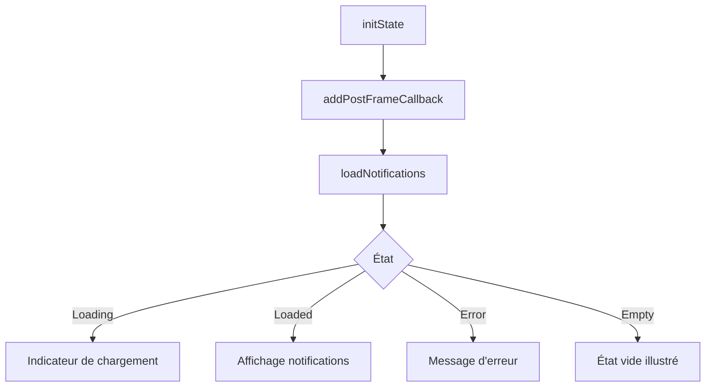

# 📊 Dashboard Professionnel - Documentation Technique

## 📌 Vue d'ensemble

Le Dashboard Professionnel (`home_selleur.dart`) est la page d'accueil centrale pour les vendeurs professionnels. Elle offre une vue consolidée des notifications de demandes de pièces, avec des actions rapides pour gérer l'activité commerciale.

## 🎯 Objectif Principal

Fournir aux vendeurs professionnels un hub centralisé pour :
- Visualiser les nouvelles demandes de pièces automobiles
- Répondre rapidement aux demandes clients
- Accéder aux principales fonctionnalités de gestion
- Suivre l'activité commerciale en temps réel

## 🏗️ Architecture Technique

### Localisation
```
lib/src/features/parts/presentation/pages/Vendeur/home_selleur.dart
```

### Type de Widget
- **ConsumerStatefulWidget** : Utilise Riverpod pour la gestion d'état réactive
- **Stateful** : Gère les interactions utilisateur et le rafraîchissement des données

### Providers Utilisés
| Provider | Rôle | Type |
|----------|------|------|
| `sellerDashboardControllerProvider` | Gestion des notifications | StateNotifier |
| `currentSellerProviderAlt` | Informations vendeur connecté | AsyncValue<Seller> |
| `rejectPartRequestUseCaseProvider` | Logique de rejet de demande | UseCase |

## 📱 Interface Utilisateur

### Structure de la Page

#### 1. **AppBar Personnalisée**
```dart
- Titre: "Mes Notifications"
- Couleur: Bleu primaire (#007AFF)
- Actions: Menu vendeur (hamburger)
- Design: Gradient subtil pour profondeur visuelle
```

#### 2. **En-tête Personnalisé**
- **Salutation dynamique** basée sur :
  - Nom de l'entreprise (prioritaire)
  - Prénom + Nom du vendeur
  - "Bonjour Vendeur" par défaut
- **Message contextuel** :
  - Nombre de nouvelles demandes
  - "Tout est à jour" si aucune notification

#### 3. **Section Notifications**
- **Affichage limité** : 3 premières notifications
- **Carte de notification moderne** :
  - Icône véhicule
  - Informations du véhicule
  - Liste des pièces demandées
  - Badge "Nouveau"
  - Actions : Répondre / Refuser

#### 4. **Lien "Voir toutes les demandes"**
- Affiché si plus de 3 notifications
- Navigation vers la page complète des notifications
- Compteur des demandes restantes

#### 5. **Call-to-Action Principal**
```dart
- Bouton: "Déposer une annonce"
- Style: Plein, bleu primaire
- Icône: add_circle_outline
- Navigation: /seller/add
```

## 🔄 Flux de Données

### Chargement Initial


### Rafraîchissement Pull-to-Refresh
1. Déclenchement : Glissement vers le bas
2. Feedback haptique léger
3. Appel : `refresh()` sur le controller
4. Mise à jour automatique de l'UI

## 💼 Fonctionnalités Clés

### 1. **Accepter et Répondre**
```dart
_acceptAndRespond(context, partRequest)
```
- Crée ou récupère une conversation existante
- Génère un message pré-rempli contextuel
- Navigation vers la conversation avec message
- Rafraîchit les notifications

### 2. **Refuser une Demande**
```dart
_rejectRequest(context, partRequest)
```
- Affiche une confirmation iOS native
- Enregistre le refus en base
- Notification de succès/erreur
- Met à jour la liste

### 3. **Navigation Contextuelle**
- Vers conversation : `/seller/conversation/{id}`
- Vers toutes les notifications : `seller-notifications`
- Vers ajout d'annonce : `/seller/add`

## 🎨 Design System

### Couleurs Utilisées
| Couleur | Valeur | Usage |
|---------|--------|-------|
| `primaryBlue` | #007AFF | Actions principales, AppBar |
| `darkBlue` | #1C1C1E | Textes principaux |
| `gray` | #8E8E93 | Textes secondaires |
| `white` | #FFFFFF | Fonds, textes sur foncé |
| `success` | #34C759 | Badges, validations |
| `error` | #FF3B30 | Actions destructives |

### Composants Réutilisables
- `_ModernNotificationCard` : Carte de notification stylisée
- `_StatsCard` : Carte de statistiques (préparé pour futur)
- `_QuickActionCard` : Carte d'action rapide (préparé pour futur)

## 🔐 Gestion des Erreurs

### États d'Erreur Gérés
1. **Vendeur non connecté** : Redirection ou message d'erreur
2. **Échec de chargement** : Bouton "Réessayer"
3. **Erreur de création conversation** : Notification toast
4. **ID utilisateur manquant** : Exception capturée

### Feedback Utilisateur
- **Succès** : Toast vert avec icône check
- **Erreur** : Toast rouge avec détails
- **Info** : Toast bleu pour actions en cours

## 📊 États de la Page

### 1. État Initial
- Texte : "Bienvenue dans votre espace vendeur"
- Pas de notifications affichées

### 2. État Chargement
- Indicateur de progression circulaire centré
- Couleur : Bleu primaire

### 3. État Vide
- Illustration : Icône notifications_none
- Message : "Aucune nouvelle demande"
- Sous-titre explicatif

### 4. État Erreur
- Icône : error_outline rouge
- Message d'erreur personnalisé
- Bouton "Réessayer"

### 5. État Chargé
- Liste des notifications (max 3)
- Actions disponibles par notification
- Lien vers toutes si > 3

## 🚀 Optimisations Performance

### Techniques Utilisées
1. **Lazy Loading** : Chargement à la demande
2. **Memoization** : Via Riverpod providers
3. **Debouncing** : Sur les actions utilisateur
4. **Haptic Feedback** : Retour tactile immédiat

### Bonnes Pratiques
```dart
// Vérification mounted avant navigation
if (!mounted) return;

// Context.mounted pour les opérations async
if (context.mounted) {
  notificationService.error(context, message);
}

// AddPostFrameCallback pour init après build
WidgetsBinding.instance.addPostFrameCallback((_) {
  // Initialisation
});
```

## 🔧 Configuration Requise

### Dépendances
```yaml
- flutter_riverpod: ^2.x
- go_router: ^13.x
- supabase_flutter: ^2.x
- flutter/services (HapticFeedback)
```

### Permissions
- Accès réseau pour Supabase
- Vibration pour feedback haptique

## 📱 Responsive Design

### Breakpoints
- **Mobile** : < 600px (optimisé)
- **Tablet** : 600-900px (adaptatif)
- **Desktop** : > 900px (non prioritaire)

### Adaptations
- Padding dynamique selon taille écran
- Taille de police responsive
- Nombre de colonnes variable (futur)

## 🧪 Points de Test

### Tests Unitaires
- [ ] Chargement des notifications
- [ ] Filtrage par statut
- [ ] Génération message pré-rempli
- [ ] Gestion des erreurs

### Tests d'Intégration
- [ ] Flux accepter → conversation
- [ ] Flux refuser → mise à jour
- [ ] Pull-to-refresh complet
- [ ] Navigation entre pages

### Tests UI
- [ ] Affichage correct des états
- [ ] Animations et transitions
- [ ] Feedback haptique
- [ ] Accessibilité

## 📈 Métriques à Suivre

1. **Temps de réponse moyen** aux demandes
2. **Taux d'acceptation** vs refus
3. **Temps de chargement** des notifications
4. **Taux d'erreur** sur les actions
5. **Engagement** avec les notifications

## 🔮 Évolutions Futures

### Court Terme
- [ ] Pagination des notifications
- [ ] Filtres par type de pièce
- [ ] Recherche dans les demandes
- [ ] Notifications push

### Moyen Terme
- [ ] Statistiques détaillées (cards)
- [ ] Actions rapides (quick actions)
- [ ] Mode sombre
- [ ] Export des demandes

### Long Terme
- [ ] Dashboard analytics complet
- [ ] IA pour suggestions de réponse
- [ ] Automatisation des réponses
- [ ] Intégration CRM

## 🐛 Problèmes Connus

1. **TODO** : Récupérer vraies infos vendeur depuis provider
2. **TODO** : Implémenter navigation conversation detail
3. **Limitation** : Affichage limité à 3 notifications
4. **Performance** : Pas de pagination côté serveur

## 📚 Ressources Liées

- [Architecture Clean](../architecture/clean-architecture.md)
- [Guide Riverpod](../state-management/riverpod-guide.md)
- [Design System](../design/design-system.md)
- [Tests Dashboard](../tests/dashboard-tests.md)

---

**Dernière mise à jour** : 20/09/2025
**Mainteneur** : Équipe Développement Professional
**Version** : 1.0.0