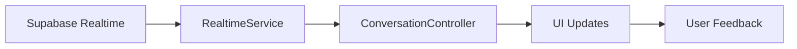

# 💬 Système de Messagerie - Documentation Technique

## 📌 Vue d'ensemble

Le système de messagerie professionnel comprend deux composants principaux :
- **Liste des conversations** (`messages_page.dart`) : Vue groupée des conversations par demande
- **Détail conversation** (`conversation_detail_page.dart`) : Chat temps réel avec un client

## 🎯 Objectif Principal

Permettre aux vendeurs professionnels de :
- Communiquer efficacement avec les clients
- Gérer plusieurs conversations simultanément
- Envoyer des offres commerciales structurées
- Partager des images de pièces
- Suivre l'historique des échanges

## 🏗️ Architecture Technique

### Composants Principaux

#### 1. Page Liste des Messages
```
lib/src/features/parts/presentation/pages/Vendeur/messages_page.dart
```

#### 2. Page Détail Conversation
```
lib/src/features/parts/presentation/pages/Vendeur/conversation_detail_page.dart
```

### Stack Technologique
| Technologie | Rôle |
|------------|------|
| **Riverpod** | Gestion d'état réactive |
| **Supabase Realtime** | Messages temps réel |
| **GoRouter** | Navigation entre pages |
| **Image Picker** | Capture/sélection photos |

## 📱 Liste des Conversations

### Structure de la Page

#### AppBar avec Compteur
```dart
AppBar:
  - Titre: "Messages clients"
  - Badge: Nombre total non lus (99+ max)
  - Action: Bouton refresh manuel
  - Couleur: Bleu primaire (#1E66F5)
```

#### Corps de la Page
```dart
RefreshIndicator → ListView:
  - Pull-to-refresh intégré
  - Cartes groupées par demande
  - Mise à jour temps réel
```

### Système de Groupement

Les conversations sont **groupées par demande de pièce** :
```dart
ConversationGroup {
  requestId: String
  requestTitle: String (pièces demandées)
  vehicleInfo: String
  conversations: List<Conversation>
  totalUnread: int
}
```

**Avantages du groupement** :
- Vision consolidée par demande client
- Suivi de l'historique complet
- Gestion multi-vendeurs possible

### Providers Utilisés
| Provider | Type | Rôle |
|----------|------|------|
| `conversationsControllerProvider` | StateNotifier | Logique métier |
| `conversationGroupsProvider` | List<Group> | Données groupées |
| `totalUnreadCountProvider` | int | Badge compteur |
| `isLoadingProvider` | bool | État chargement |

## 💬 Détail Conversation

### Interface Chat Instagram-like

#### En-tête Style Instagram
```
┌─────────────────────────────────────┐
│ [←] [Avatar] Nom Client        [📞][📹][⋮] │
│              En ligne                │
└─────────────────────────────────────┘
```

#### Zone de Messages
- **Bulles différenciées** : Vendeur (bleu) vs Client (gris)
- **Avatar client** : Photo ou initiales
- **Timestamps** : Format relatif (il y a 2h)
- **États messages** : Envoyé, Reçu, Lu

#### Zone de Saisie Enrichie
```
┌─────────────────────────────────────┐
│ [📷] [🖼️] [💰] | Message... | [Envoyer] │
└─────────────────────────────────────┘
```

### Types de Messages Supportés

| Type | Icône | Description | Métadonnées |
|------|-------|-------------|-------------|
| **Text** | - | Message texte simple | - |
| **Image** | 🖼️ | Photo pièce/véhicule | URL, fileName |
| **Offer** | 💰 | Proposition commerciale | price, delivery_days |
| **System** | ℹ️ | Messages automatiques | eventType |

## 🔄 Flux Temps Réel

### Architecture Realtime


### Subscription Lifecycle
```dart
1. initState():
   - Charger messages existants
   - Marquer comme lu
   - S'abonner aux nouveaux messages

2. Réception message:
   - Mise à jour état local
   - Auto-scroll vers le bas
   - Notification sonore (optionnel)

3. dispose():
   - Annuler subscriptions
   - Libérer ressources
```

## 💼 Fonctionnalités Avancées

### 1. Envoi d'Offres Commerciales
```dart
_createOffer():
  1. Dialog modale stylisée
  2. Saisie prix + délai livraison
  3. Validation des données
  4. Envoi message type "offer"
  5. Affichage carte spéciale
```

**Interface Offre** :
- Design moderne avec gradient bleu
- Validation temps réel
- Feedback visuel immédiat

### 2. Partage d'Images
```dart
Options disponibles:
  - Camera: Prise photo directe
  - Galerie: Sélection existante
  - Compression: 1920x1080 max, 85% qualité
  - Upload: Supabase Storage
```

### 3. Actions Rapides
- **Appel téléphonique** : Intégration native
- **Appel vidéo** : WhatsApp ou fallback
- **Fermer conversation** : Avec confirmation
- **Supprimer** : Action destructive protégée

## 🎨 Design System Messagerie

### Palette Couleurs Messages
| Élément | Couleur | Code Hex | Usage |
|---------|---------|----------|-------|
| Message vendeur | Bleu | #3B82F6 | Bulles envoyées |
| Message client | Gris clair | #F3F4F6 | Bulles reçues |
| Badge non lu | Rouge | #EF4444 | Indicateur nouveau |
| En ligne | Vert | #10B981 | Statut actif |

### Composants Réutilisables
- `MessageBubbleWidget` : Bulle de message adaptative
- `ChatInputWidget` : Zone de saisie enrichie
- `ConversationGroupCard` : Carte conversation groupée
- `LoadingWidget` : Indicateur chargement unifié

## 🔐 Sécurité et Permissions

### Contrôles d'Accès
```dart
Vérifications:
  - User authentifié (Supabase Auth)
  - Seller ID valide
  - Propriétaire conversation
  - Rate limiting messages
```

### Validation des Données
```dart
// Avant envoi message
if (content.trim().isEmpty) return;
if (!mounted) return;
if (userId == null) throw UnauthorizedException();
```

### Gestion des Erreurs
- **Réseau** : Retry automatique + cache local
- **Upload** : Validation taille + format
- **Permissions** : Demande explicite caméra/galerie

## 🚀 Optimisations Performance

### Techniques Implémentées

#### 1. Lazy Loading Messages
```dart
// Chargement par batch de 50
loadConversationMessages(conversationId, limit: 50)
```

#### 2. Debouncing Typing
```dart
// Éviter spam updates "typing..."
Timer? _typingTimer;
_onTyping() {
  _typingTimer?.cancel();
  _typingTimer = Timer(Duration(seconds: 2), _stopTyping);
}
```

#### 3. Image Optimization
```dart
ImagePicker settings:
  - maxWidth: 1920
  - maxHeight: 1080
  - quality: 85
```

#### 4. Memory Management
```dart
@override
void dispose() {
  _messageSubscription?.cancel();
  _scrollController.dispose();
  _messageController.dispose();
}
```

## 📱 Responsive & Adaptabilité

### Points de Rupture
| Device | Largeur | Adaptations |
|--------|---------|-------------|
| Mobile | < 600px | Optimisé par défaut |
| Tablet | 600-900px | 2 colonnes conversations |
| Desktop | > 900px | Panel latéral + détail |

### Gestes Supportés
- **Swipe** : Actions rapides (futur)
- **Long press** : Menu contextuel
- **Pull-to-refresh** : Actualisation
- **Pinch-to-zoom** : Images

## 🧪 Scénarios de Test

### Tests Unitaires
- [ ] Envoi/réception messages
- [ ] Validation offres commerciales
- [ ] Upload images
- [ ] Gestion états conversation

### Tests d'Intégration
- [ ] Flow complet conversation
- [ ] Synchronisation realtime
- [ ] Persistance hors ligne
- [ ] Recovery après déconnexion

### Tests UI/UX
- [ ] Auto-scroll nouveaux messages
- [ ] Indicateurs lecture
- [ ] Animations transitions
- [ ] Feedback haptique

## 📊 Métriques à Suivre

### KPIs Messagerie
1. **Temps de réponse moyen** : < 2 heures
2. **Taux de conversion** : Message → Vente
3. **Messages par conversation** : Moyenne
4. **Taux d'utilisation offres** : %
5. **Satisfaction client** : Notes conversation

### Analytics Events
```dart
Events à tracker:
  - message_sent: {type, conversation_id}
  - offer_created: {price, delivery_days}
  - image_shared: {size, format}
  - conversation_closed: {reason, duration}
  - call_initiated: {type: phone/video}
```

## 🔮 Évolutions Futures

### Court Terme (v1.1)
- [ ] Indicateur "typing..."
- [ ] Réactions emoji aux messages
- [ ] Messages vocaux
- [ ] Templates de réponses

### Moyen Terme (v1.2)
- [ ] Traduction automatique
- [ ] Chatbot assistance
- [ ] Partage documents PDF
- [ ] Historique recherchable

### Long Terme (v2.0)
- [ ] Video chat intégré
- [ ] IA suggestions réponses
- [ ] Intégration CRM
- [ ] Analytics conversation

## 🐛 Problèmes Connus

### Bugs Actuels
1. **Scroll** : Parfois ne scroll pas au dernier message
2. **Badge** : Compteur peut être désynchronisé
3. **Images** : Chargement lent sur 3G

### Limitations
- Pas de messages hors ligne
- Limite 10MB par image
- Pas de modification messages envoyés
- Historique limité à 6 mois

## 📚 Documentation Associée

### Liens Internes
- [Providers Conversations](../providers/conversations-providers.md)
- [Realtime Service](../services/realtime-service.md)
- [Message Entities](../entities/message-entity.md)
- [Tests Messagerie](../tests/messaging-tests.md)

### Ressources Externes
- [Supabase Realtime Docs](https://supabase.com/docs/guides/realtime)
- [Flutter Image Picker](https://pub.dev/packages/image_picker)
- [URL Launcher](https://pub.dev/packages/url_launcher)
- [Material Chat UI](https://material.io/design/communication/chat.html)

## 🔒 Compliance RGPD

### Protection des Données
- Chiffrement messages en transit
- Suppression après 6 mois
- Droit à l'oubli implémenté
- Export données sur demande

### Consentements Requis
- Accès caméra/galerie
- Notifications push
- Stockage local
- Partage numéro téléphone

---

**Dernière mise à jour** : 20/09/2025
**Mainteneur** : Équipe Professional
**Version** : 1.0.0
**Statut** : Production Ready ✅